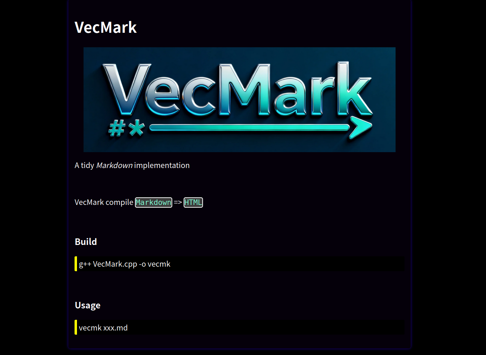

# VecMark

A tidy *Markdown* implementation

VecMark compile `Markdown` => `HTML`

Support grammar is in `SupportGrammar.md`

### Build
> g++ VecMark.cpp -o vecmk

### Usage
> ./vecmk xxx.md

### Bootstrap
> ./vecmk README.md

